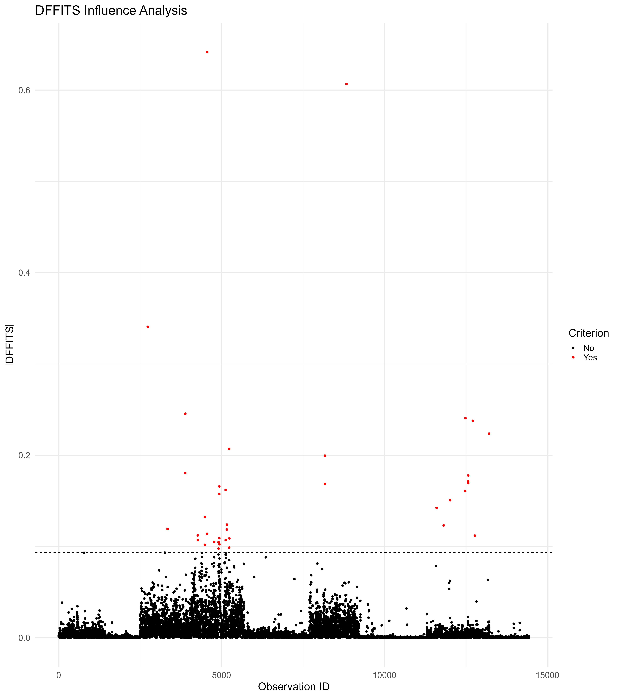

```{r, include=FALSE}
knitr::opts_chunk$set(warning = FALSE, 
                      message = FALSE,
                      cache = TRUE, 
                      cache.path = "cache/5.5/")
```


# 5.5 Model Diagnostics {-}

This code performs diagnostic analysis for survey-weighted regression models. It configures the survey design, fits a model for household expenditure, and evaluates it through: 1) $R^2$ calculation, 2) residual analysis (histogram/QQ plots), and 3) influence diagnostics (Cook's Distance, DFBETAS, DFFITS). The implementation handles complex survey features like stratification and sampling weights.

### Prepare the work environment {-}

This block sets up the working environment to perform **diagnostics for linear models using complex survey data**. It begins by clearing memory, loading essential libraries, and ensuring correct usage of `dplyr::select`. Then, it loads the preprocessed dataset (`IND_data_regression`) and defines the **survey design object (`ESS4_design`)**, incorporating stratification, primary sampling units (PSU), and calibrated survey weights. Lastly, a log transformation is applied to per capita expenditure to prepare the response variable for subsequent modeling.


```{r}

#------------------------------------------------------------------------------#
#                           Cleaning R Environment                             #
#------------------------------------------------------------------------------#

# Remove all objects from the environment to avoid conflicts
rm(list = ls())

# Perform garbage collection to free memory
gc()

#------------------------------------------------------------------------------#
#                                Libraries                                     #
#------------------------------------------------------------------------------#

# Load required packages for data handling, survey analysis, and diagnostics

library(dplyr)        
library(survey)       
library(srvyr)       
library(data.table)  
library(magrittr)     
library(haven)        
library(tidyr)        
library(svydiags)     # Survey diagnostics
library(ggplot2)      
library(broom)       

# Ensure dplyr's select function is correctly used to avoid conflicts
select <- dplyr::select

#------------------------------------------------------------------------------#
#                           Loading Dataset                                    #
#------------------------------------------------------------------------------#

# Load the dataset containing survey information
IND_data_regression <- readRDS("data/data_ESS4/IND_data_regression.rds")

#------------------------------------------------------------------------------#
#                        Defining Survey Design                                #
#------------------------------------------------------------------------------#

# Set survey options to avoid errors in single PSU strata
options(survey.lonely.psu = "fail")

# Define the survey design object using weighted data
ESS4_design <- IND_data_regression %>%
  filter(percapita_expenditure > 0) %>%
  as_survey_design(
    ids = ea_id,         # Primary Sampling Units (PSU)
    strata = strata,     # Stratification variable
    weights = pw_w4,     # Sampling weights
    nest = TRUE
  ) %>%
  mutate(log_expenditure = log(percapita_expenditure + 70)) # Log transformation

```


This block fits a **linear regression model** using the `svyglm()` function, where the dependent variable is the log of per capita expenditure. The model includes main effects and an interaction between area of residence and religion, as well as sex and age group. This structure allows for exploring how social and demographic factors influence individual spending levels in a statistically sound, design-aware manner.

```{r}
#------------------------------------------------------------------------------#
#                     Estimating Survey-weighted Model                         #
#------------------------------------------------------------------------------#

# Define and estimate a survey-weighted regression model
EXP_model <- svyglm(
  log_expenditure ~ 1 + Zone * Religion + Zone + Sex + age_group,
  design = ESS4_design
)
```

This block displays the statistical summary of the survey-weighted linear model fitted to the ESS4 data. The model examines how demographic and social characteristics—such as area of residence, religion, sex, and age group—are associated with the log of per capita expenditure. The output includes estimated coefficients, standard errors, t-values, and significance levels. Interaction terms between religion and area allow for testing whether religious spending patterns differ across urban and rural settings. The high statistical significance of several predictors confirms their importance in explaining spending behavior.

```{r, eval=TRUE, echo=TRUE}
# Display model summary and coefficients
summary(EXP_model)
```


The model shows that living in urban areas is associated with **62% higher** per capita spending, while women spend on average **6% less** than men. Religious differences are also notable: Catholics, Protestants, and Muslims show **significantly lower** spending compared to the reference group, although urban Catholics offset this with a **+90%** interaction effect. Spending decreases with age, particularly among those aged 66 and older (**-17.5%**). Urban–religion interactions suggest the urban advantage varies across religious groups.


```{r, eval=FALSE, echo=TRUE}
tidy(EXP_model) 
```


```{r, eval=TRUE, echo=FALSE}
library(kableExtra)
tidy(EXP_model) %>%  kable(format = "html") %>%
  kable_styling(full_width = FALSE)
```

### Model Fit: $R^2$ Calculation  {-}

Here, the **survey-adjusted R²** is computed by comparing the fitted model to a null (intercept-only) model. Total variance and residual variance are extracted from each model summary, and $R^2$ is calculated as the proportion of variance explained by the model. This provides a sense of how well the independent variables explain differences in per capita expenditure.

```{r}
#------------------------------------------------------------------------------#
#                   Model Fit: R² Calculation                                  #
#------------------------------------------------------------------------------#

# Fit a null model (intercept-only) for R² computation
null_model <- svyglm(log(percapita_expenditure + 1) ~ 1, design = ESS4_design)

# Extract residual dispersion values
s1 <- summary(EXP_model)
s0 <- summary(null_model)

# Compute weighted R² using total variance and residual variance
wSST <- s0$dispersion  # Total variance
wSSE <- s1$dispersion  # Residual variance

R2 <- 1 - (wSSE / wSST)  # R² formula
R2  # Display computed R² value
```

### Standardized Residuals Analysis  {-}

This block assesses the **distribution of standardized residuals** from the fitted model to check the assumption of normality. A histogram overlaid with a theoretical normal curve and a Q-Q plot (quantile–quantile plot) are generated. These visual tools help detect skewness, outliers, or departures from normality that could affect model validity.


```{r, eval=FALSE}
#------------------------------------------------------------------------------#
#                     Standardized Residuals Analysis                          #
#------------------------------------------------------------------------------#

# Compute standardized residuals from the model
stdresids <- as.numeric(svystdres(EXP_model)$stdresids)

# Attach residuals to the dataset
# ESS4_design$variables %<>% mutate(stdresids = stdresids)

# Histogram of standardized residuals
ggplot(data = data.frame(stdresids), aes(x = stdresids)) +
  geom_histogram(
    aes(y = ..density..),
    bins = 30,
    fill = "#CCE5FF",
    color = "black"
  ) +
  stat_function(
    fun = dnorm,
    args = list(mean = 0, sd = 1),
    color = "black",
    size = 1
  ) +
  labs(title = "Standardized Residuals", x = "Residuals", y = "Density") +
  theme_minimal(base_size = 20) +
  theme(plot.title = element_text(hjust = 0.5))
```


```{r, eval=FALSE}
# Q-Q plot to assess normality of residuals
ggplot(data = data.frame(stdresids), aes(sample = stdresids)) +
  stat_qq() +
  stat_qq_line(color = "red") +
  labs(title = "Q-Q Plot of Standardized Residuals",
       x = "Theoretical Quantiles", y = "Sample Quantiles") +
  theme_minimal(base_size = 20)+
  theme(plot.title = element_text(hjust = 0.5))
```

{}


```{r, echo=FALSE, eval=FALSE}
p01 <- ggplot(data = data.frame(stdresids), aes(x = stdresids)) +
  geom_histogram(
    aes(y = ..density..),
    bins = 30,
    fill = "#CCE5FF",
    color = "black"
  ) +
  stat_function(
    fun = dnorm,
    args = list(mean = 0, sd = 1),
    color = "black",
    size = 1
  ) +
  labs(title = "Standardized Residuals", x = "Residuals", y = "Density") +
  theme_minimal(base_size = 20) +
  theme(plot.title = element_text(hjust = 0.5))

ggsave(plot = p01,
       filename = "images/5.5/01_standardized_residuals.pdf", scale = 3)

ggsave(plot = p01,
       filename = "images/5.5/01_standardized_residuals.png", scale = 3)


# Q-Q plot to assess normality of residuals
p02 <- ggplot(data = data.frame(stdresids), aes(sample = stdresids)) +
  stat_qq() +
  stat_qq_line(color = "red") +
  labs(title = "Q-Q Plot of Standardized Residuals",
       x = "Theoretical Quantiles", y = "Sample Quantiles") +
  theme_minimal(base_size = 20)+
  theme(plot.title = element_text(hjust = 0.5))

ggsave(plot = p02,
       filename = "images/5.5/02_qqplot.pdf", width = 12, height = 12)
ggsave(plot = p02,
       filename = "images/5.5/02_qqplot.png", width = 12, height = 12)

```


### Influential Observations {-}

#### Cook's Distance {-}

This part computes **Cook’s Distance** to detect observations that have a disproportionate influence on the model’s parameter estimates. Observations exceeding a threshold (e.g., >3) are flagged as influential and visualized in a scatter plot, with red dots indicating high influence.

```{r, eval=FALSE}
#------------------------------------------------------------------------------#
#                         Influential Observations                             #
#------------------------------------------------------------------------------#

#---------------------#
# Cook's Distance     #
#---------------------#

# Compute Cook's Distance and flag influential observations
CooksD <- data.frame(
  cook = svyCooksD(EXP_model),
  id = 1:length(svyCooksD(EXP_model))
) %>%
  mutate(Criterion = ifelse(cook > 3, "Yes", "No"))

# Scatter plot of Cook's Distance
ggplot(CooksD, aes(y = cook, x = id)) +
  geom_point(aes(col = Criterion)) +
  geom_hline(aes(yintercept = 3), color = "black", linetype = "dashed") +
  scale_color_manual(values = c("Yes" = "red", "No" = "black")) +
  theme_minimal(base_size = 20) +
  labs(title = "Cook's Distance", x = "Observation ID", y = "Cook's D")
```


```{r, eval=FALSE, echo=FALSE}
CooksD <- data.frame(
  cook = svyCooksD(EXP_model),
  id = 1:length(svyCooksD(EXP_model))
) %>%
  mutate(Criterion = ifelse(cook > 3, "Yes", "No"))

# Scatter plot of Cook's Distance
p03 <- ggplot(CooksD, aes(y = cook, x = id)) +
  geom_point(aes(col = Criterion)) +
  geom_hline(aes(yintercept = 3), color = "black", linetype = "dashed") +
  scale_color_manual(values = c("Yes" = "red", "No" = "black")) +
  theme_minimal(base_size = 20) +
  labs(title = "Cook's Distance", x = "Observation ID", y = "Cook's D")

ggsave(plot = p03,
       filename = "images/5.5/03_Cook_Distance.pdf", width = 16, height = 12)

ggsave(plot = p03,
       filename = "images/5.5/03_Cook_Distance.png", width = 16, height = 12)
```


#### DFBETAS {-}

The **DFBETAS** analysis measures how much each coefficient would change if a specific observation were removed. The values are reshaped into long format and plotted with facets, one for each model term. Observations above the threshold are flagged as influential, offering insight into which points affect specific parameters.


```{r}
#---------------------#
# DFBETAS Analysis    #
#---------------------#

# Compute DFBETAS for all model coefficients
d_dfbetas <- svydfbetas(EXP_model)$Dfbetas %>%
  t() %>%
  as.data.frame()

# Rename DFBETAS columns
colnames(d_dfbetas) <- paste0("beta[", seq_len(ncol(d_dfbetas)) - 1, "]")

# Convert DFBETAS to long format
d_dfbetas_long <- d_dfbetas %>%
  mutate(id = row_number()) %>%
  pivot_longer(cols = -id, names_to = "Variable", values_to = "value")

# Get threshold for influential observations
cutoff <- svydfbetas(EXP_model)$cutoff

# Flag influential observations
d_dfbetas_long <- d_dfbetas_long %>%
  mutate(Criterion = ifelse(abs(value) > cutoff, "Yes", "No"))
```


```{r, echo=TRUE, eval=FALSE}
# Plot DFBETAS
ggplot(d_dfbetas_long ,
       aes(y = abs(value), x = id)) +
  geom_point(aes(color = Criterion)) +
  geom_hline(aes(yintercept = cutoff), linetype = "dashed") +
  facet_wrap(. ~ Variable, nrow = 4, scales = "free_y") +
  scale_color_manual(values = c("Yes" = "red", "No" = "black")) +
  labs(title = "DFBETAS Analysis", x = "Observation ID", y = expression(abs(beta))) +
  theme_minimal(base_size = 20)
```


```{r, eval=FALSE, echo=FALSE}
# Plot DFBETAS
p04 <- ggplot(d_dfbetas_long ,
       aes(y = abs(value), x = id)) +
  geom_point(aes(color = Criterion)) +
  geom_hline(aes(yintercept = cutoff), linetype = "dashed") +
  facet_wrap(. ~ Variable, nrow = 4, scales = "free_y") +
  scale_color_manual(values = c("Yes" = "red", "No" = "black")) +
  labs(title = "DFBETAS Analysis", x = "Observation ID", y = expression(abs(beta))) +
  theme_minimal(base_size = 20)

ggsave(plot = p04,
       filename = "images/5.5/04_DFBETAS.pdf", width = 16, height = 18)

ggsave(plot = p04,
       filename = "images/5.5/04_DFBETAS.png", width = 16, height = 18)
```

#### DFFITS {-}

This section calculates **DFFITS**, which assesses the influence of each observation on its own predicted value. Observations with high DFFITS are flagged and visualized in a scatter plot, helping identify cases that disproportionately affect fitted values.

```{r}
#---------------------#
# DFFITS Analysis     #
#---------------------#

# Compute DFFITS values
d_dffits <- data.frame(
  dffits = svydffits(EXP_model)$Dffits,
  id = 1:length(svydffits(EXP_model)$Dffits)
)

# Get influence threshold
cutoff <- svydffits(EXP_model)$cutoff

# Flag influential observations
d_dffits <- d_dffits %>%
  mutate(Criterion = ifelse(abs(dffits) > cutoff, "Yes", "No"))
```


```{r, eval=FALSE, echo=TRUE}
# Plot DFFITS values
ggplot(d_dffits, aes(y = abs(dffits), x = id)) +
  geom_point(aes(color = Criterion)) +
  geom_hline(yintercept = cutoff, linetype = "dashed", color = "black") +
  scale_color_manual(values = c("Yes" = "red", "No" = "black")) +
  labs(title = "DFFITS Influence Analysis", x = "Observation ID", y = expression(abs(DFFITS))) +
  theme_minimal(base_size = 20)


```




```{r, eval=FALSE, echo=FALSE}
# Plot DFFITS values
p05 <- ggplot(d_dffits, aes(y = abs(dffits), x = id)) +
  geom_point(aes(color = Criterion)) +
  geom_hline(yintercept = cutoff, linetype = "dashed", color = "black") +
  scale_color_manual(values = c("Yes" = "red", "No" = "black")) +
  labs(title = "DFFITS Influence Analysis", x = "Observation ID", y = expression(abs(DFFITS))) +
  theme_minimal(base_size = 20)

ggsave(plot = p05,
       filename = "images/5.5/05_DFFITS.pdf", width = 16, height = 18)

ggsave(plot = p05,
       filename = "images/5.5/05_DFFITS.png", width = 16, height = 18)

```
