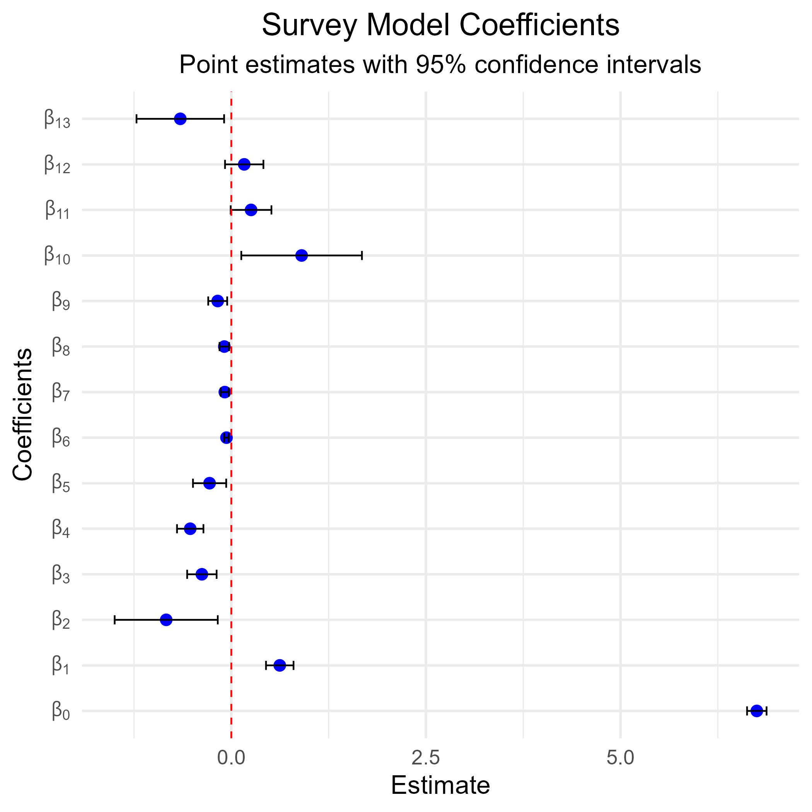
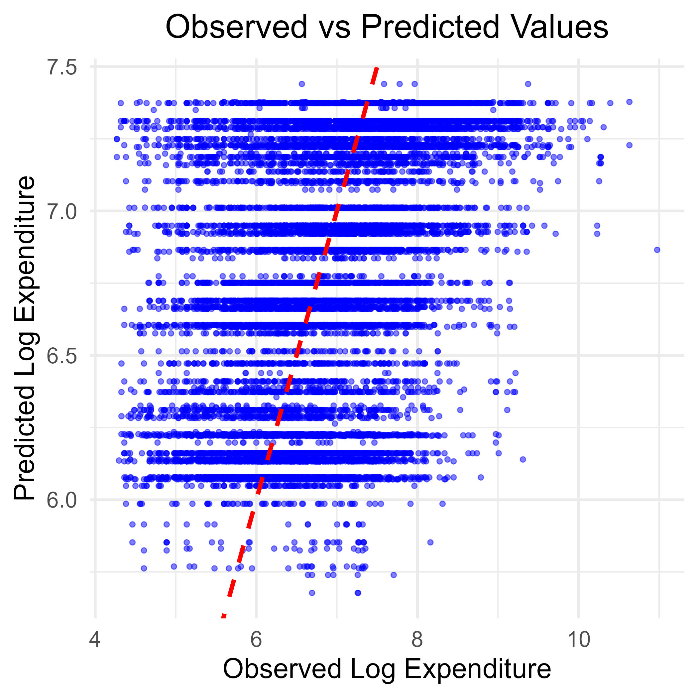

```{r, include=FALSE}
knitr::opts_chunk$set(warning = FALSE, 
                      message = FALSE,
                      cache = TRUE, 
                      cache.path = "cache/5.6/")
```

# 5.6 Inference on Model Parameters {-}

This section performs inference on the parameters of a weighted linear regression model fitted to the log of per capita expenditure using ESS4 survey data. Coefficient estimates are extracted, visualized with confidence intervals, and model predictions are compared against observed values. This approach helps identify statistically significant effects and assess overall model fit under a complex survey design.

### Prepare the work environment {-}

This initial block prepares the working environment to perform weighted regressions using ESS4 survey data. It begins by clearing memory and loading the required libraries for complex survey analysis, data handling, and model diagnostics. The processed dataset (`IND_data_regression`) is then imported, and a complex survey design object (`ESS4_design`) is defined, incorporating primary sampling units, stratification, and final weights. Finally, per capita expenditure is log-transformed to approximate normality and ensure the validity of linear model assumptions.

```{r}
#------------------------------------------------------------------------------#
#                           Cleaning R Environment                             #
#------------------------------------------------------------------------------#

rm(list = ls())
gc()

#------------------------------------------------------------------------------#
#                                Libraries                                     #
#------------------------------------------------------------------------------#

library(dplyr)
library(survey)
library(srvyr)
library(data.table)
library(magrittr)
library(haven)
library(stringr)
library(tidyr)
library(svydiags)
library(ggplot2)
library(broom)

# Ensure the correct use of dplyr's select function
select <- dplyr::select

#------------------------------------------------------------------------------#
#                           Loading Datasets                                   #
#------------------------------------------------------------------------------#

IND_data_regression <- readRDS("data/data_ESS4/IND_data_regression.rds")

#------------------------------------------------------------------------------#
# Defining the survey design for weighted regression
#------------------------------------------------------------------------------#

# Set survey options to handle single PSU issues
options(survey.lonely.psu = "fail") 

# Define survey design with appropriate stratification and weighting
ESS4_design <- IND_data_regression %>%
  filter(percapita_expenditure > 0)   %>% 
  as_survey_design(
    ids = ea_id,       # Primary Sampling Unit (PSU)
    strata = strata,   # Stratification variable
    weights = pw_w4,   # Survey weights
    nest = TRUE
  ) %>% 
  mutate(log_expenditure = log(percapita_expenditure + 70)) # Log transformation for normality
```

###  Estimating Linear Models  {-}

This block estimates a survey-weighted linear regression model using the complex design from the ESS4 dataset. The dependent variable is the log of per capita expenditure, with predictors including area of residence, religion, sex, and age group, as well as an interaction between area and religion. The `svyglm()` function ensures valid standard errors and inference under the complex design. The code outputs the model summary and estimated coefficients.

```{r}
#------------------------------------------------------------------------------#
#                         Estimating Linear Models                             #
#------------------------------------------------------------------------------#

# Survey-weighted linear model for log expenditure
EXP_model <-
  svyglm(log_expenditure  ~ 1 + Zone * Religion + Zone + Sex + age_group,
         design = ESS4_design)

# Display model coefficients
summary(EXP_model)
EXP_model %>% coef()
```

### Inference on Model Parameters {-}

This block extracts the estimated model coefficients along with their 95% confidence intervals and prepares labels for graphical display. LaTeX-style expressions (e.g., $\beta_0, \beta_1, \dots$) are generated to visually identify each parameter in plots. This formatting enables a clearer and more professional presentation of regression results.


```{r}
#------------------------------------------------------------------------------#
#                    Inference on Model Parameters                             #
#------------------------------------------------------------------------------#

# Extract coefficients and confidence intervals
coef_df <- tidy(EXP_model, conf.int = TRUE)


# Define factor labels for coefficients
coef_df$beta <- factor(
  paste0("beta[", 1:nrow(coef_df) -1, "]"),
  ordered = TRUE,
  levels = paste0("beta[", 1:nrow(coef_df) - 1, "]"),
  labels = paste0("beta[", 1:nrow(coef_df) - 1, "]")
)


# Generate LaTeX-like expressions for beta coefficients
beta_labels <- setNames(
  lapply(0:(nrow(coef_df) - 1), function(i) bquote(beta[.(i)])),
  paste0("beta[", 0:(nrow(coef_df) - 1), "]")
)
```

This block generates a plot of the survey-weighted linear model coefficients, displaying point estimates with 95% confidence intervals. Each coefficient is labeled using LaTeX-style notation ( $\beta_0, \beta_1, \dots$*, etc.) on the vertical axis, enhancing clarity and professionalism. A dashed red line at zero provides a reference to identify non-significant effects.


```{r, eval=FALSE, echo=TRUE}
# Plot model coefficients with confidence intervals
ggplot(coef_df, aes(x = beta, y = estimate)) +
  geom_point(size = 3, color = "blue") +  # Point estimates
  geom_errorbar(aes(ymin = conf.low, ymax = conf.high),
                width = 0.2,
                color = "black") +
  geom_hline(yintercept = 0,
             linetype = "dashed",
             color = "red") +  # Zero-reference line
  labs(
    title = "Survey Model Coefficients",
    subtitle = "Point estimates with 95% confidence intervals",
    x = "Coefficients",
    y = "Estimate"
  ) +
  theme_minimal(base_size = 16) +
  theme(plot.title = element_text(hjust = 0.5),
        plot.subtitle = element_text(hjust = 0.5)) +
  scale_x_discrete(labels = beta_labels) +  # Use LaTeX expressions for labels
  coord_flip()  # Flip axes for readability
```


```{r, eval=FALSE, echo=FALSE}
# Plot model coefficients with confidence intervals
p01 <- ggplot(coef_df, aes(x = beta, y = estimate)) +
  geom_point(size = 3, color = "blue") +  # Point estimates
  geom_errorbar(aes(ymin = conf.low, ymax = conf.high),
                width = 0.2,
                color = "black") +
  geom_hline(yintercept = 0,
             linetype = "dashed",
             color = "red") +  # Zero-reference line
  labs(
    title = "Survey Model Coefficients",
    subtitle = "Point estimates with 95% confidence intervals",
    x = "Coefficients",
    y = "Estimate"
  ) +
  theme_minimal(base_size = 16) +
  theme(plot.title = element_text(hjust = 0.5),
        plot.subtitle = element_text(hjust = 0.5)) +
  scale_x_discrete(labels = beta_labels) +  # Use LaTeX expressions for labels
  coord_flip()  # Flip axes for readability

ggsave(plot = p01,
       filename = "images/5.6/01_Plot_model_coefficients.pdf", scale = 3)

ggsave(plot = p01,
       filename = "images/5.6/01_Plot_model_coefficients.png", scale = 3)

```



### Comparison: Predicted vs Observed Values {-}

This block extracts the predicted values from the survey-weighted linear model (`EXP_model`) and compares them to the observed values of log per capita expenditure. This comparison is essential for assessing model fit and identifying potential systematic deviations between estimated and actual values.


```{r, eval=TRUE, echo=TRUE}
#------------------------------------------------------------------------------#
#                     Comparison: Predicted vs Observed Values                 #
#------------------------------------------------------------------------------#

# Extract predicted values from the model
predicted_values <- predict(EXP_model) %>% data.frame()

# Extract observed values from the dataset
observed_values <- ESS4_design$variables$log_expenditure
```

This scatter plot compares the observed log per capita expenditure with the values predicted by the model. Each point represents an individual, and the red dashed line indicates perfect prediction (observed = predicted). The closer the points are to this line, the better the model fit. This visualization helps identify systematic bias or patterns of over/underestimation.

```{r, eval=FALSE, echo=TRUE}
# Create scatter plot of observed vs predicted values
ggplot(data = data.frame(observed = observed_values, predicted = predicted_values[,1]), 
       aes(x = observed, y = predicted)) +
  geom_point(alpha = 0.5, color = "blue") +  # Scatter plot with transparency
  geom_abline(intercept = 0, slope = 1, color = "red", linetype = "dashed",
              linewidth = 1.5) +  # Reference line
  labs(
    title = "Observed vs Predicted Values",
    x = "Observed Log Expenditure",
    y = "Predicted Log Expenditure"
  ) +
  theme_minimal(base_size = 20) +
  theme(plot.title = element_text(hjust = 0.5))

```


```{r, eval=FALSE, echo=FALSE}
# Create scatter plot of observed vs predicted values
p02 <- ggplot(data = data.frame(observed = observed_values, predicted = predicted_values[,1]), 
       aes(x = observed, y = predicted)) +
  geom_point(alpha = 0.5, color = "blue") +  # Scatter plot with transparency
  geom_abline(intercept = 0, slope = 1, color = "red", linetype = "dashed",
              linewidth = 1.5) +  # Reference line
  labs(
    title = "Observed vs Predicted Values",
    x = "Observed Log Expenditure",
    y = "Predicted Log Expenditure"
  ) +
  theme_minimal(base_size = 20) +
  theme(plot.title = element_text(hjust = 0.5))


ggsave(plot = p02,
       filename = "images/5.6/02_observed_vs_predicted_values.pdf", scale = 3)

ggsave(plot = p02,
       filename = "images/5.6/02_observed_vs_predicted_values.png", scale = 3)


```

