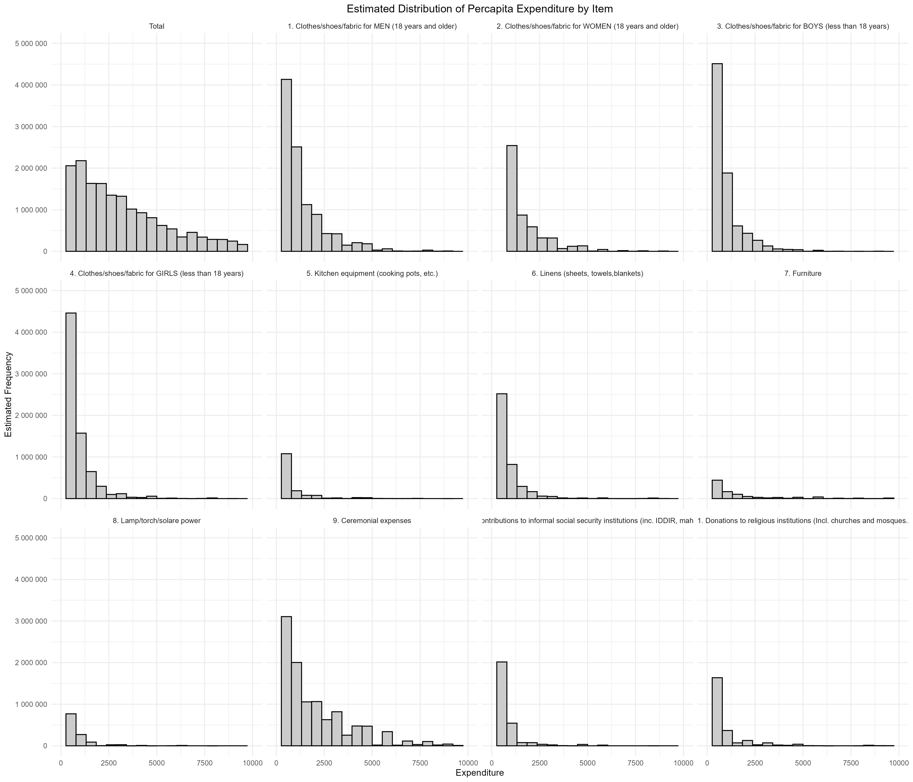

```{r, include=FALSE}
knitr::opts_chunk$set(warning = FALSE, 
                      message = FALSE,
                      cache = TRUE, 
                      cache.path = "cache/7.2/")
```

# 7.2 Histograms  {-}

This section presents a series of **survey-weighted histograms** to analyze the **distribution of per capita household expenditure on non-food goods and services**, based on the Ethiopia Living Standards Measurement Study (ESS4, 2018/19). Using data from the expenditure and household cover modules, the dataset includes:

- Total household expenditure on non-food items  
- Per capita expenditure, adjusted for household size  
- Comparisons by item and by geographic zone (urban/rural)

All histograms are generated using the complex survey design (clusters, stratification, and expansion weights), ensuring nationally representative estimates. Visualizations include both `svyhist()` and `ggplot2`-based histograms, which show the distribution of spending for each item, as well as comparisons between urban and rural households.

This graphical approach helps identify **consumption patterns and disparities** in access to non-food goods and services. It provides key insights into how expenditures vary across items and regions, offering valuable evidence for policy design and socioeconomic diagnostics.


### Prepare the work environment {-}

This initial block sets up the environment for performing statistical analysis on **non-food household expenditures** using data from the ESS4 survey (Ethiopia, 2018/19). It begins by clearing memory and loading the necessary libraries for data manipulation, complex survey analysis, and visualization. Then, it loads the **household expenditure section** of the questionnaire, recoding non-reported amounts as zero and converting item codes to factor variables.

The data is reshaped into **wide format**, with each item becoming a separate column and missing values filled with zeros. The **total household expenditure** is computed by summing all non-food items. This dataset is then merged with the household cover file to calculate **per capita expenditure**, by dividing total expenditure by household size (`saq09`).

Finally, a **complex survey design object** is defined to enable valid inference. The design incorporates:  
- Primary sampling units (`ea_id`)  
- Stratification by region and urban/rural zone  
- Final sampling weights (`pw_w4`)

This setup ensures that all estimates reflect national population parameters for expenditure-related indicators.

```{r}
#------------------------------------------------------------------------------#
#                           Cleaning R Environment                             #
#------------------------------------------------------------------------------#
rm(list = ls())  
gc()             
#------------------------------------------------------------------------------#
#                                Libraries                                     #
#------------------------------------------------------------------------------#


library(dplyr)     
library(survey)     
library(srvyr)      
library(data.table) 
library(magrittr)   
library(haven)     
library(stringr)   
library(tidyr)     
library(knitr)     
library(kableExtra) 
library(broom)      
library(ggplot2)    
library(scales)     
library(forcats)   

# Ensure select function from dplyr is used explicitly
select <- dplyr::select

#------------------------------------------------------------------------------#
#                           Loading Datasets                                   #
#------------------------------------------------------------------------------#

# Load household expenditure dataset (from World Bank survey)
HH_data <- read_sav("data/data_ESS4/sect7b_hh_w4_v2.sav") %>%
  mutate(expenditure = ifelse(s7q03 == 2, 0, s7q04),
         # Assign zero to non-expenditures
         item = as_factor(item_cd_12months)         
         # Convert item codes to factors
  )

# Convert data to wide format:
# - Items become column names
# - Missing values filled with zero
# - Calculate total expenditure per household
EXP_data <- HH_data %>%
  select(household_id, item, expenditure) %>%
  pivot_wider(
    names_from = item,
    values_from = expenditure,
    values_fill = list(expenditure = 0)
  ) %>%
  mutate(total_expenditure = rowSums(select(., where(is.numeric)), na.rm = TRUE))


# Load additional household data and merge with expenditure dataset
EXP2_data <- read_sav("data/data_ESS4/sect_cover_hh_w4.sav") %>% 
  inner_join(EXP_data) %>%
  # Compute per capita expenditure
  mutate(percapita_expenditure = total_expenditure / saq09)

#------------------------------------------------------------------------------#
#                      Defining Survey Design for Analysis                     #
#------------------------------------------------------------------------------#

# Define survey design:
# - Primary Sampling Unit (PSU) identified by `ea_id`
# - Stratification based on region (`saq01`) and urban/rural status (`saq14`)
# - Sampling weights (`pw_w4`) ensure representativity
ESS4_design <- EXP2_data %>% 
  mutate(strata = paste0(saq01, "_", saq14)) %>% 
  as_survey_design(
    ids = ea_id,  
    strata = strata,  
    weights = pw_w4,  
    nest = TRUE  
  )

options(survey.lonely.psu = "fail") 
summary(ESS4_design)

```

###  Histogram using Survey-Weighted Data {-}

This block generates a **histogram of per capita expenditure** using survey-weighted data from the ESS4 dataset. The `svyhist()` function is used, which accounts for the complex survey design (stratification, clustering, and weights). A total of 100 bins are defined to provide a detailed view of the distribution, and the x-axis is limited to values between 0 and 10,000 birr. This visualization allows exploration of the **estimated national distribution of per capita spending**, ensuring results reflect population-level patterns.

```{r}
#------------------------------------------------------------------------------#
#                      Histogram using Survey-Weighted Data                    #
#------------------------------------------------------------------------------#

# Generate a histogram for per capita expenditure using survey weights
svyhist(
  ~ percapita_expenditure,
  ESS4_design,
  main = "Estimated Distribution of Percapita Expenditure",
  col = "grey80",
  breaks = 100, # Number of bins
  xlab = "Expenditure",
  probability = FALSE, # Normalize to probability density
  xlim = c(0, 10000)  # Limit x-axis range
)
```


###  Preparing Data for ggplot2 Visualization {-}

This block prepares a combined dataset for visualization with `ggplot2`. Using `bind_rows()`, it merges two types of expenditure records:  
1. **Total household expenditure**, from the coverage file (`EXP2_data`).  
2. **Itemized expenditure data**, from the original dataset (`HH_data`).  

Both sources are standardized to include household ID, area classification (rural/urban), expenditure amount, survey weight, and item label. The total expenditure entries are tagged under a new `"Total"` category within the `item` variable. Additionally, the `saq14` variable is recoded to label areas clearly as either **RURAL** or **URBAN**, enabling effective comparisons by geographic location in upcoming visual analyses.

```{r}
#------------------------------------------------------------------------------#
#                      Preparing Data for ggplot2 Visualization                #
#------------------------------------------------------------------------------#

# Create a dataset for visualization:
# - Combine total household expenditures with item-wise expenditures
HH_data2 <- bind_rows(
  EXP2_data %>%
    transmute(
      household_id,
      saq14 = as_factor(saq14),
      expenditure = total_expenditure,
      pw_w4,
      item = as_factor("Total")
    ),
  HH_data %>%
    transmute(
      household_id,
      saq14 = as_factor(saq14),
      expenditure,
      pw_w4,
      item = item
    )
) %>%
  mutate(saq14 = case_when(
    saq14 == "1. RURAL" ~ "RURAL",
    saq14 == "2. URBAN" ~ "URBAN",
    TRUE ~ saq14
  ))
```

### Histogram for Expenditure Distribution {-}

This block generates a set of survey-weighted histograms to visualize the **distribution of per capita expenditure** across various non-food items, including total expenditure. Using `ggplot2`, the histograms are grouped by item using `facet_wrap()` in a 3x4 grid layout. Each plot displays the estimated frequency (weighted by `pw_w4`) of households according to their expenditure levels, restricted to a range of 0 to 10,000 currency units. The y-axis labels are formatted to clearly show large values. This visual approach helps identify spending patterns and compare expenditure distributions across different goods and services.

```{r, eval=FALSE}
#------------------------------------------------------------------------------#
#                      Histogram for Expenditure Distribution                  #
#------------------------------------------------------------------------------#

ggplot(HH_data2, aes(x = expenditure, weight = pw_w4)) +
  geom_histogram(fill = "grey80", 
                 color = "black", 
                 bins = 20) +
  facet_wrap(. ~ item, nrow = 3, ncol = 4) +  # Arrange plots in a 3x4 grid
  scale_x_continuous(limits = c(0, 10000)) +  # Restrict x-axis range
  scale_y_continuous(limits = c(0, 5000000), labels = label_number(accuracy = 1)) +
  labs(
    y = "Estimated Frequency",
    x = "Expenditure",
    title = "Estimated Distribution of Percapita Expenditure by Item"
  ) +
  theme_minimal(base_size = 10) +
  theme(plot.title = element_text(hjust = 0.5))  # Center title
```


```{r, eval=FALSE, echo=FALSE}
#------------------------------------------------------------------------------#
#                      Histogram for Expenditure Distribution                  #
#------------------------------------------------------------------------------#

p01 <- ggplot(HH_data2, aes(x = expenditure, weight = pw_w4)) +
  geom_histogram(fill = "grey80", 
                 color = "black", 
                 bins = 20) +
  facet_wrap(. ~ item, nrow = 3, ncol = 4) +  # Arrange plots in a 3x4 grid
  scale_x_continuous(limits = c(0, 10000)) +  # Restrict x-axis range
  scale_y_continuous(limits = c(0, 5000000), labels = label_number(accuracy = 1)) +
  labs(
    y = "Estimated Frequency",
    x = "Expenditure",
    title = "Estimated Distribution of Percapita Expenditure by Item"
  ) +
  theme_minimal(base_size = 10) +
  theme(plot.title = element_text(hjust = 0.5))  # Center title

ggsave(plot = p01,
       filename = "images/7.2/01_Histogram.pdf", width = 14, height = 12)

ggsave(plot = p01,
       filename = "images/7.2/01_Histogram.png", width = 14, height = 12)

```



This block generates a series of weighted histograms to compare the **distribution of per capita expenditure between urban and rural areas** across various non-food items, including total spending. Using `ggplot2` and `facet_wrap()`, it creates a grid of plots for each item. Bars are color-coded: blue for rural and light salmon for urban zones, with transparency (`alpha = 0.5`) to allow overlap visualization. This approach enables the identification of differences in spending patterns by geographic location, highlighting urban–rural disparities in access or consumption behavior.

```{r, eval=FALSE, echo=TRUE}
#------------------------------------------------------------------------------#
#          Histogram Comparing Urban vs. Rural Expenditure Distribution        #
#------------------------------------------------------------------------------#

ggplot(HH_data2, aes(x = expenditure, weight = pw_w4,
                     fill = saq14)) +
  geom_histogram(color = "black", 
                 bins = 20, 
                 position = "identity",
                 alpha = 0.5) +
  facet_wrap(. ~ item, nrow = 3, ncol = 4) +
  scale_x_continuous(limits = c(0, 10000)) +
  scale_y_continuous(limits = c(0, 5000000), labels = label_number(accuracy = 1)) +
  scale_fill_manual(values = c("URBAN" = "#E6B9AA", "RURAL" = "blue")) +  # Light pastel colors
  labs(
    y = "Estimated Frequency",
    x = "Expenditure",
    title = "Estimated Distribution of Percapita Expenditure by Item",
    fill = "Zone"
  ) +
  theme_minimal(base_size = 10) +
  theme(plot.title = element_text(hjust = 0.5))  # Center title

```

```{r, eval=FALSE, echo=FALSE}
#------------------------------------------------------------------------------#
#          Histogram Comparing Urban vs. Rural Expenditure Distribution        #
#------------------------------------------------------------------------------#

p02 <- ggplot(HH_data2, aes(x = expenditure, weight = pw_w4,
                     fill = saq14)) +
  geom_histogram(color = "black", 
                 bins = 20, 
                 position = "identity",
                 alpha = 0.5) +
  facet_wrap(. ~ item, nrow = 3, ncol = 4) +
  scale_x_continuous(limits = c(0, 10000)) +
  scale_y_continuous(limits = c(0, 5000000), labels = label_number(accuracy = 1)) +
  scale_fill_manual(values = c("URBAN" = "#E6B9AA", "RURAL" = "blue")) +  # Light pastel colors
  labs(
    y = "Estimated Frequency",
    x = "Expenditure",
    title = "Estimated Distribution of Percapita Expenditure by Item",
    fill = "Zone"
  ) +
  theme_minimal(base_size = 10) +
  theme(plot.title = element_text(hjust = 0.5))  # Center title

ggsave(plot = p02,
       filename = "images/7.2/01_Histogram_zone.pdf", width = 14, height = 12)

ggsave(plot = p02,
       filename = "images/7.2/01_Histogram_zone.png", width = 14, height = 12)

```

