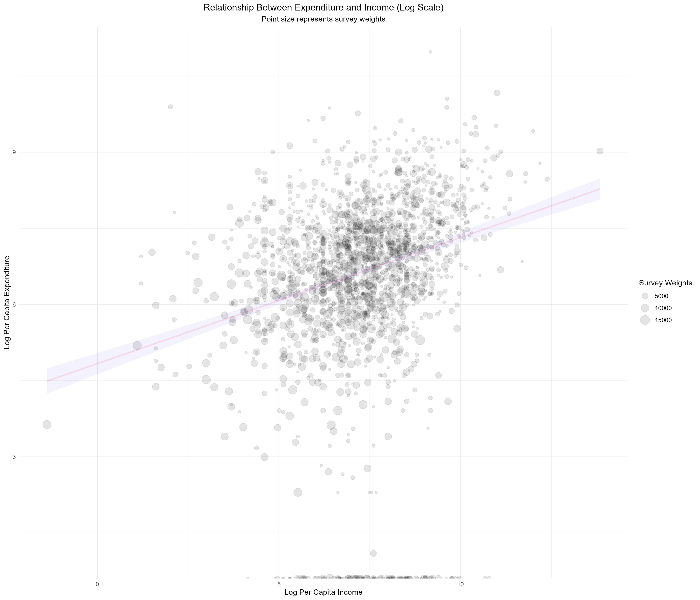

```{r, include=FALSE}
knitr::opts_chunk$set(warning = FALSE, 
                      message = FALSE,
                      cache = TRUE, 
                      cache.path = "cache/7.3/")
```

# 7.3 Scatter Plots - Relationship Between Expenditure and Income{-}

This section analyzes the relationship between income and per capita expenditure using ESS4 data (Ethiopia, 2018/19). Total household expenditure is computed from non-food items, and income is summed across sources. Per capita measures are then derived using household size. A scatter plot with log-transformed values, weighted by survey weights, is produced to visualize patterns between income and spending.

### Prepare the work environment {-}

This initial block prepares the environment for analyzing **household non-food expenditures** based on Section 7B of the Ethiopian Socioeconomic Survey (ESS4, 2018/19). It starts by clearing the memory and loading the necessary libraries for handling survey data, manipulating datasets, and creating statistical graphics. The script then loads the dataset `sect7b_hh_w4_v2.sav`, which contains household-level responses regarding expenditures on various non-food goods and services over the past 12 months.

To ensure accurate expenditure estimates:
- Non-reported expenditures (`s7q03 == 2`) are recoded to zero.
- The item code variable (`item_cd_12months`) is converted into a factor for clearer grouping and visualization.

This setup is the foundation for producing descriptive statistics, visualizations, or advanced models of household non-food consumption patterns.


```{r}

#------------------------------------------------------------------------------#
#                           Cleaning R Environment                             #
#------------------------------------------------------------------------------#
rm(list = ls())  
gc()             

#------------------------------------------------------------------------------#
#                                Libraries                                     #
#------------------------------------------------------------------------------#

library(dplyr)
library(survey)
library(srvyr)
library(data.table)
library(magrittr)
library(haven)
library(stringr)
library(tidyr)
library(knitr)
library(kableExtra)
library(broom)
library(ggplot2)
library(scales)
library(forcats)

# Ensure select function from dplyr is used explicitly
select <- dplyr::select


#------------------------------------------------------------------------------#
#                           Loading Datasets                                   #
#------------------------------------------------------------------------------#


# Load household expenditure dataset (from World Bank survey)
EXP_data <- read_sav("data/data_ESS4/sect7b_hh_w4_v2.sav") %>% 
  mutate(
    expenditure = ifelse(s7q03 == 2, 0, s7q04), # Assign zero to non-expenditures
    item = as_factor(item_cd_12months)         # Convert item codes to factors
  )

```

This block prepares household expenditure and income data from the ESS4 survey. First, it transforms the non-food expenditure dataset (`EXP_data`) from long to wide format, converting each expenditure item into a separate column. Missing values are replaced with zeros, and total household expenditure is calculated by summing all recorded item expenses.

Next, it loads the household income dataset (`sect13_hh_w4_v2.sav`), which includes whether households reported receiving income from each source (`s13q01`) and corresponding amounts (`s13q02`). For each income source, it creates: 1) a continuous 'income' variable (zero for no income), and 2) a binary '`yes_no`' indicator for income receipt, enabling subsequent analyses like proportion calculations or counts of active income sources per household.

```{r}
# Convert data to wide format:
# - Items become column names
# - Missing values filled with zero
# - Calculate total expenditure per household
EXP2_data <- EXP_data %>% 
  select(household_id, item, expenditure) %>% 
  pivot_wider(names_from = item, values_from = expenditure, values_fill = list(expenditure = 0)) %>% 
  mutate(total_expenditure = rowSums(select(., where(is.numeric)), na.rm = TRUE))


# Load household income dataset
INC_data <- read_sav("data/data_ESS4/sect13_hh_w4_v2.sav")

# Process income data:
# - Identify if the household received income from a given source (s13q01)
# - Assign zero if no income, otherwise assign reported amount (s13q02)
INC_data <- INC_data %>% 
  group_by(item = source_cd) %>%
  mutate(
    income = ifelse(s13q01 == 2, 0, s13q02),
    yes_no = ifelse(s13q01 == 2, 0, 1)
  )
```

This block is responsible for consolidating household-level income. First, it filters only the observations where the household reported having received income from at least one source (`s13q01 == 1`). Then, it groups the data by household identifier (`household_id`) and sums all reported amounts to calculate the total household income.

Subsequently, this income information is merged with the expenditure database (`EXP2_data`), keeping only the key variables: the household identifier and total expenditure. The result is a new dataset that contains both the total expenditure and total income for each household that reported income, enabling comparative analysis or the construction of derived indicators such as the income-expenditure ratio or measures of economic well-being

```{r}
# Aggregate total income per household, only considering valid income sources
INC_data <- INC_data %>%  
  filter(s13q01 == 1) %>% 
  group_by(household_id) %>% 
  summarise(total_income = sum(income))

# Merge household expenditure data with income data
INC_data <- inner_join(EXP2_data %>% select(household_id, total_expenditure),
                          INC_data)
```

This code block aims to integrate household sociodemographic information and compute key economic indicators at the per capita level. First, it loads the household characteristics dataset (`sect_cover_hh_w4.sav`), which includes, among other variables, household size (`saq09`). This information is then merged with a previously constructed dataset containing total income and expenditure per household. From this merged data, per capita expenditure and income are calculated by dividing the totals by the number of household members, along with their logarithmic transformations. These variables enable more robust comparisons across households of different sizes and prepare the data for subsequent statistical analysis.

```{r, warning=FALSE,error=FALSE,message=FALSE}
# Load household characteristics data
HH_data <- read_sav("data/data_ESS4/sect_cover_hh_w4.sav")

# Merge household data with income and expenditure data
HH_data <- HH_data %>% inner_join(INC_data)

# Compute per capita expenditure and per capita income
HH_data <- HH_data %>%
  mutate(
    percapita_expenditure = total_expenditure / saq09,
    log_expenditure = log(percapita_expenditure),
    percapita_income = total_income / saq09,
    log_income = log(percapita_income)
    
  )

```

### Scatter Plots of Expenditure vs Income {-}

This block generates a **scatter plot** to explore the relationship between **per capita income** and **per capita expenditure**, both transformed to a logarithmic scale. Each point represents a household, with its size proportional to the survey weight (`pw_w4`), ensuring visual emphasis on households with greater representativity. A linear trend line is overlaid to help visualize the general association. The use of transparency (`alpha`) helps address overplotting, while the `geom_smooth()` function adds a fitted regression line with a shaded confidence band. This visualization is crucial for identifying patterns or inequalities in household spending behavior relative to income.

```{r, eval=FALSE, echo=TRUE}

#------------------------------------------------------------------------------#
#                 Scatter Plots of Expenditure vs Income                       #
#------------------------------------------------------------------------------#

# Scatter plot: Log-transformed per capita expenditure vs. income
ggplot(HH_data, aes(y = log_expenditure, 
                     x = log_income, weight = pw_w4)) +
  geom_point(aes(size = pw_w4), alpha = 0.1) +
  labs(
    title = "Relationship Between Expenditure and Income (Log Scale)",
    subtitle = "Point size represents survey weights",
    y = "Log Per Capita Expenditure",
    x = "Log Per Capita Income",
    size = "Survey Weights"
  ) +
  theme_minimal() +
  theme(
    plot.title = element_text(hjust = 0.5),  # Center title
    plot.subtitle = element_text(hjust = 0.5)  # Center subtitle
  ) +
  geom_smooth(method = "lm", 
              color = scales::alpha("red", 0.1), 
              fill= "blue", 
              alpha = 0.05)

```


```{r, echo=FALSE, eval=FALSE}

# Scatter plot: Log-transformed per capita expenditure vs. income
p01 <- ggplot(HH_data, aes(y = log_expenditure, 
                     x = log_income, weight = pw_w4)) +
  geom_point(aes(size = pw_w4), alpha = 0.1) +
  labs(
    title = "Relationship Between Expenditure and Income (Log Scale)",
    subtitle = "Point size represents survey weights",
    y = "Log Per Capita Expenditure",
    x = "Log Per Capita Income",
    size = "Survey Weights"
  ) +
  theme_minimal() +
  theme(
    plot.title = element_text(hjust = 0.5),  # Center title
    plot.subtitle = element_text(hjust = 0.5)  # Center subtitle
  ) +
  geom_smooth(method = "lm", 
              color = scales::alpha("red", 0.1), 
              fill= "blue", 
              alpha = 0.05)


ggsave(plot = p01,
       filename = "images/7.3/01_Scatter_plot.pdf", width = 14, height = 12)

ggsave(plot = p01,
       filename = "images/7.3/01_Scatter_plot.png", width = 14, height = 12)

```

