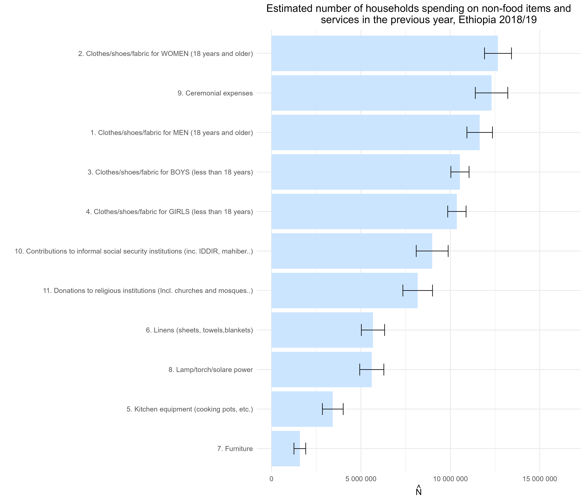
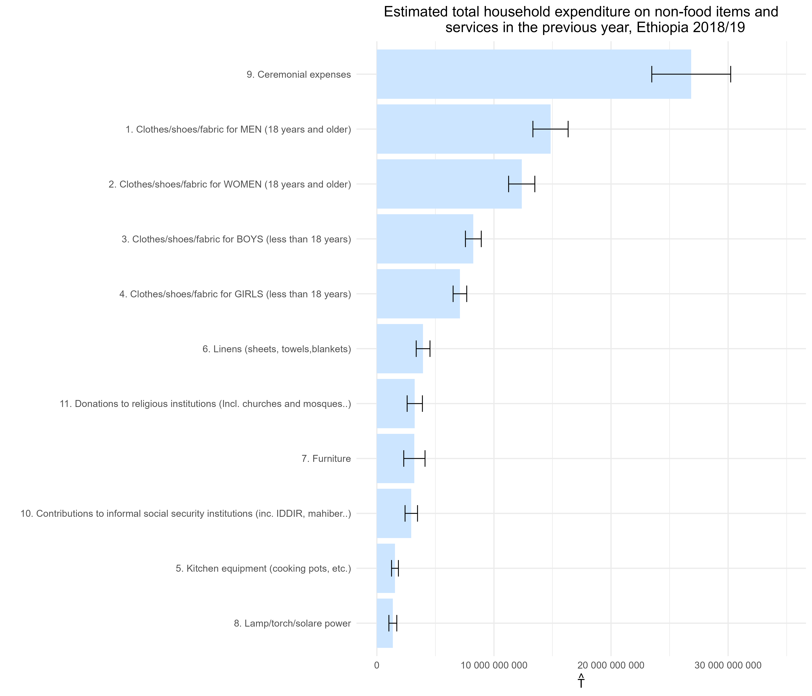

# 7.1 Bar charts {-}

This section presents a series of bar charts based on household-level data from Section 7 of the Ethiopia Socioeconomic Survey (ESS4), focusing on non-food expenditure. Using the complex survey design, three key indicators are estimated for each type of non-food item or service reported over the past 12 months:

- **$\hat{N}$**: Estimated number of households who spent on the item.  
- **$\hat{P}$**: Estimated proportion of households with such expenditure.  
- **$\hat{T}$**: Estimated total household expenditure nationwide.

Each chart includes **95% confidence intervals**, allowing clear identification of the most prevalent and financially significant spending categories across Ethiopian households.


### Prepare the work environment {-}

This initial block sets up the environment to produce bar charts on non-food expenditure using data from Section 7 of the ESS4 questionnaire. It clears the memory, loads required libraries, and imports the dataset. Then, it recodes non-reported expenses as zero and creates a binary indicator of whether the household spent on each item. Lastly, it defines the complex survey design, incorporating stratification, primary sampling units, and expansion weights—ensuring accurate and representative estimates.


```r
#------------------------------------------------------------------------------#
#                           Cleaning R Environment                             #
#------------------------------------------------------------------------------#
rm(list = ls())
gc()
```

```
##          used (Mb) gc trigger (Mb) max used (Mb)
## Ncells 534173 28.6    1196018 63.9   660380 35.3
## Vcells 945826  7.3    8388608 64.0  1769850 13.6
```

```r
#------------------------------------------------------------------------------#
#                                Libraries                                     #
#------------------------------------------------------------------------------#

library(dplyr)
library(survey)
library(srvyr)
library(data.table)
library(magrittr)
library(haven)
library(stringr)
library(tidyr)
library(ggplot2)
library(scales)
library(forcats)

#------------------------------------------------------------------------------#
#                           Loading Datasets                                   #
#------------------------------------------------------------------------------#

options(survey.lonely.psu = "fail")
HH_data <- read_sav("data/data_ESS4/sect7b_hh_w4_v2.sav")

#------------------------------------------------------------------------------#
#                             7.1 Bar Charts                                   #
#------------------------------------------------------------------------------#

# Prepare dataset:
# - Group by item category
# - Convert missing or non-reported expenditures to zero
# - Create an indicator variable (yes/no) for whether a household spent on an item

HH_data <- HH_data %>%
  group_by(item = item_cd_12months) %>%
  mutate(expenditure = ifelse(s7q03 == 2, 0, s7q04),  # If no expense, set to 0
         yes_no = ifelse(s7q03 == 2, 0, 1))           # Indicator for spending (1) or not (0)

# Defining survey design

ESS4_design <- HH_data %>%
  mutate(strata = paste0(saq01, "_", saq14)) %>%
  as_survey_design(
    ids = ea_id,
    strata = strata,
    weights = pw_w4,
    nest = TRUE
  )

options(survey.lonely.psu = "fail") 
summary(ESS4_design)
```

```
## Stratified 1 - level Cluster Sampling design (with replacement)
## With (535) clusters.
## Called via srvyr
## Probabilities:
##      Min.   1st Qu.    Median      Mean   3rd Qu.      Max. 
## 3.932e-05 1.997e-04 7.680e-04 2.814e-03 4.164e-03 1.317e-01 
## Stratum Sizes: 
##             1_1  1_2 12_1 12_2 13_1 13_2 14_2 15_1 15_2  2_1  2_2  3_1  3_2
## obs        4323 3113 2145 3300 2090 3960 8558 1760 4609 3289 2475 5269 2981
## design.PSU   35   19   19   20   18   24   52   14   28   28   15   43   18
## actual.PSU   35   19   19   20   18   24   52   14   28   28   15   43   18
##             4_1  4_2  5_1  5_2  6_1  6_2  7_1  7_2
## obs        4983 3300 3905 2805 1859 2145 4642 2959
## design.PSU   43   20   35   17   16   13   40   18
## actual.PSU   43   20   35   17   16   13   40   18
## Data variables:
##  [1] "household_id"     "item_cd_12months" "ea_id"            "saq14"           
##  [5] "pw_w4"            "saq01"            "saq02"            "saq03"           
##  [9] "saq04"            "saq05"            "saq06"            "saq07"           
## [13] "saq08"            "s7q03"            "s7q04"            "item"            
## [17] "expenditure"      "yes_no"           "strata"
```

This block computes the weighted estimates for **Table 7.3**, which summarizes household spending on nonfood items and services. For each item reported over the past 12 months, three key indicators are estimated using the complex survey design:

- **`N_hat`**: Estimated total number of households spending on the item.  
- **`P_hat`**: Proportion of households that spent on the item.  
- **`T_hat`**: Total estimated amount spent on the item across all households.

These indicators help identify the most common nonfood spending categories and their relative importance in household budgets.


```r
#------------------------------------------------------------------------------#
# TABLE 7.3 - Spending on Nonfood Items and Services
#------------------------------------------------------------------------------#
# Compute weighted estimates:
# - `N_hat`: Total number of households spending on an item
# - `P_hat`: Proportion of households spending on an item
# - `T_hat`: Total amount spent on each item

tab_03 <- ESS4_design %>%
  group_by(item) %>%
  summarise(
    N_hat = survey_total(yes_no, na.rm = TRUE, vartype = c("se", "ci")),
    P_hat = survey_mean(yes_no, na.rm = TRUE, vartype = c("se", "ci")),
    T_hat = survey_total(expenditure, na.rm = TRUE, vartype = c("se", "ci"))
  ) %>%
  mutate(item = as_factor(item))
```

### Bar Chart for Estimated Number of Households Spending on Non-Food Items {-}

This block produces a **horizontal bar chart** displaying the **estimated number of households ($\hat{N}$)** that spent on various non-food goods and services during the 12 months preceding the survey. The results are based on the ESS4 complex survey design (Ethiopia, 2018/19) and include **95% confidence intervals** shown as error bars. Items are sorted from the lowest to highest number of households, allowing for easy comparison across categories.


```r
#------------------------------------------------------------------------------#
# Bar Chart for Estimated Number of Households Spending on Non-Food Items
#------------------------------------------------------------------------------#

tab_03 <- tab_03 %>%
  mutate(item = fct_reorder(item, N_hat, .desc = FALSE))

ggplot(data = tab_03, aes(
  x = item,
  y = N_hat,
  ymax = N_hat_upp,
  ymin = N_hat_low
)) +
  geom_bar(stat = "identity",
           position = "dodge",
           fill = "#CCE5FF") +
  geom_errorbar(position = position_dodge(width = 0.9), width = 0.3) +
  scale_y_continuous(labels = label_number(accuracy = 1),
                     limits = c(0, max(tab_03$N_hat)*1.3) ) +
  labs(
    y = expression(hat(N)),
    x = "",
    title = "Estimated number of households spending on non-food items and
       services in the previous year, Ethiopia 2018/19"
  ) +
  theme_minimal(13) +
  theme(plot.title = element_text(hjust = 0.5)) +  # Centers the title
  coord_flip()
```





### Bar Chart for Estimated Total Household Expenditure on Non-Food Items{-}

This block creates a horizontal bar chart showing the estimated total household expenditure ($\hat{T}$) on various non-food goods and services over the past 12 months, based on ESS4 survey data (Ethiopia, 2018/19). The estimates include 95% confidence intervals, visualized as error bars. Items are sorted in ascending order of total expenditure, enabling identification of the categories with the highest monetary burden at the national level.


```r
#------------------------------------------------------------------------------#
# Bar Chart for Estimated Total Household Expenditure on Non-Food Items
#------------------------------------------------------------------------------#

tab_03 <- tab_03 %>% 
  mutate(item = fct_reorder(item, T_hat, .desc = FALSE))

ggplot(data = tab_03, aes(
  x = item,
  y = T_hat,
  ymax = T_hat_upp,
  ymin = T_hat_low
)) +
  geom_bar(stat = "identity",
           position = "dodge",
           fill = "#CCE5FF") +
  geom_errorbar(position = position_dodge(width = 0.9), width = 0.3) +  # Error bars for confidence intervals
  scale_y_continuous(labels = label_number(accuracy = 1),
                     limits = c(0, max(tab_03$T_hat)*1.3)) +  # Format y-axis labels
  labs(
    y = expression(hat(T)),  # LaTeX-style notation for total expenditure
    x = "",
    title = "Estimated total household expenditure on non-food items and
       services in the previous year, Ethiopia 2018/19"
  ) +
  theme_minimal(13) +
  theme(plot.title = element_text(hjust = 0.5)) +  # Centers the title
  coord_flip()
```




### Bar Chart for Estimated Proportion of Households Spending on Non-Food Items{-}

This block creates a horizontal bar chart displaying the estimated proportion of households ($\hat{P}$) that spent on various non-food goods and services during the past 12 months (ESS4, Ethiopia 2018/19). Each bar shows the fraction of households reporting expenditures, along with a 95% confidence interval. Items are ordered from the lowest to highest spending prevalence, allowing visualization of patterns in household access or needs by item category.


```r
#------------------------------------------------------------------------------#
# Bar Chart for Estimated Proportion of Households Spending on Non-Food Items
#------------------------------------------------------------------------------#

tab_03 <- tab_03 %>%
  mutate(item = fct_reorder(item, P_hat, .desc = FALSE))

ggplot(data = tab_03, aes(
  x = item,
  y = P_hat,
  ymax = P_hat_upp,
  ymin = P_hat_low
)) +
  geom_bar(stat = "identity",
           position = "dodge",
           fill = "#CCE5FF") +
  geom_errorbar(position = position_dodge(width = 0.9), width = 0.3) +
  scale_y_continuous(labels = label_number(accuracy = 0.05),
                     limits = c(0, max(tab_03$P_hat)*1.3)) +
  labs(
    y = expression(hat(P)),
    x = "",
    title = "Estimated proportion of households that spent on non-food items
       and services in the previous year, Ethiopia 2018/19"
  ) +
  theme_minimal(13) +
  theme(plot.title = element_text(hjust = 0.5)) +  # Centers the title
  coord_flip()
```


